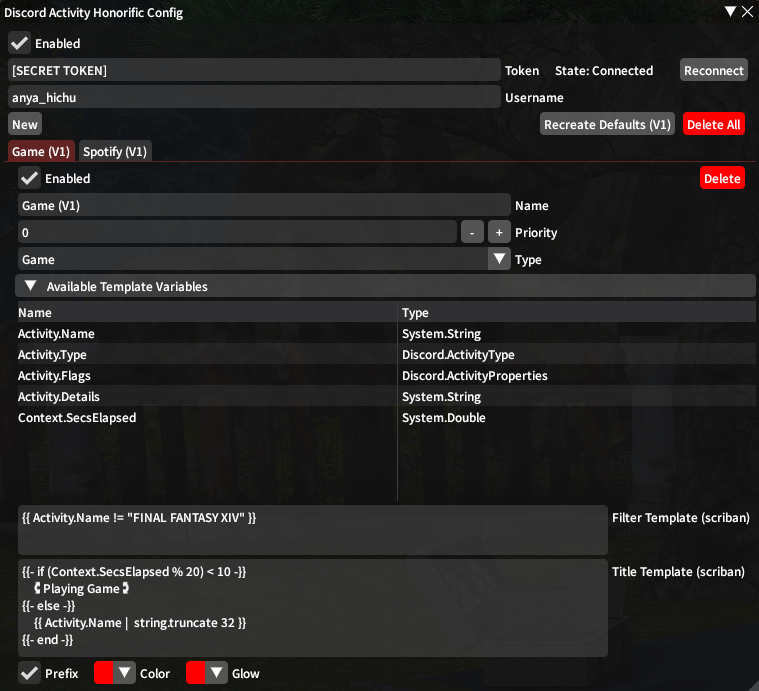
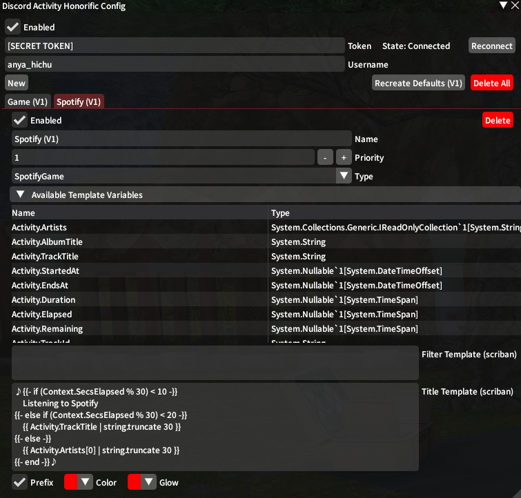
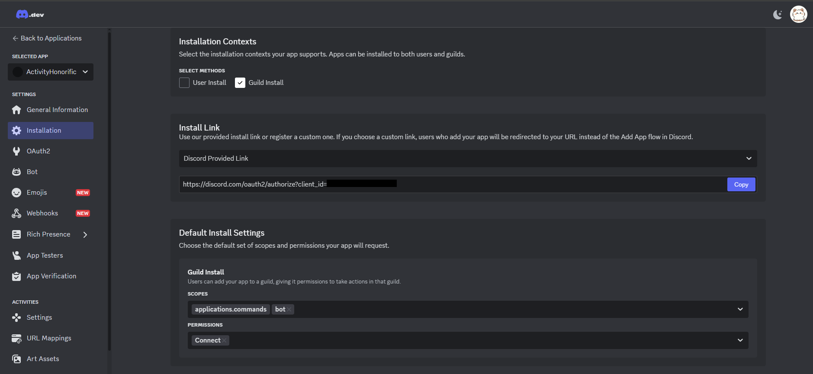
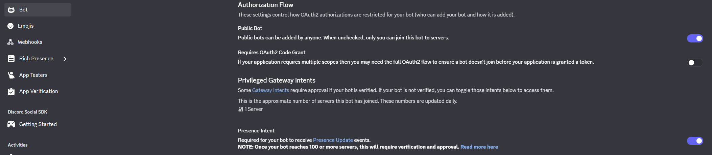
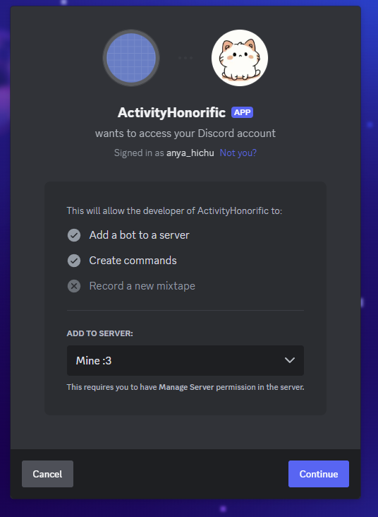
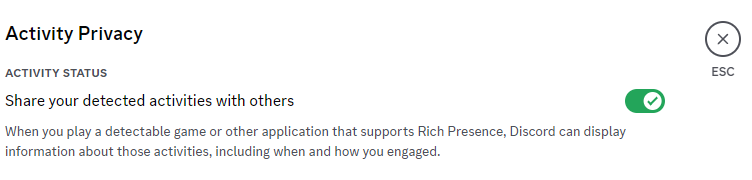

# DiscordActivityHonorific

Update honorific title based on discord activity informations.

## Installation

Installable using my custom repository (instructions here: https://github.com/anya-hichu/DalamudPluginRepo) or from compiled archives.

## Screenshots

### Game

### Spotify

## Commands

- `/discordactivityhonorific config`
- `/discordactivityhonorific enable`
- `/discordactivityhonorific disable`

# Setup
## Bot configuration (https://discord.com/developers/applications)

### Select "Connect" permission

### Check "Presence Intent"

## Invite to server or personal server

## Enable activities on server

